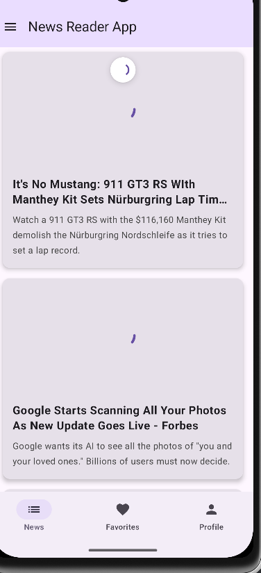
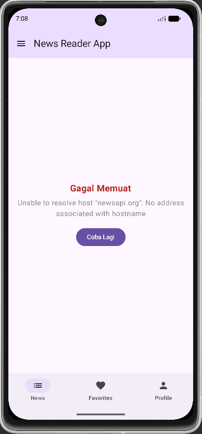
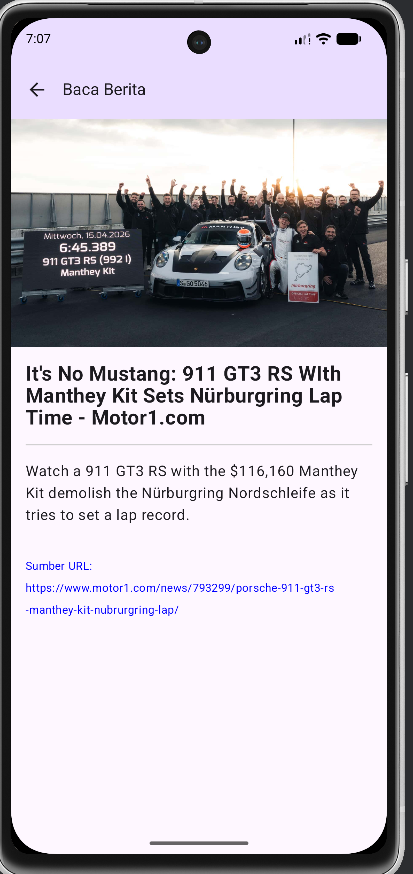

# Tugas Praktikum 6: News Reader App (Networking & REST API)

Aplikasi **News Reader** ini dikembangkan menggunakan Kotlin Multiplatform (KMP) dan Compose Multiplatform. Aplikasi ini mendemonstrasikan integrasi REST API menggunakan Ktor Client, manajemen status UI (Loading, Success, Error), serta penerapan arsitektur Repository Pattern.

## Identitas Mahasiswa
* **Nama:** Adi Septriansyah
* **NIM:** 123140021
* **Mata Kuliah:** Pengembangan Aplikasi Mobile (IF25-22017)
* **Instansi:** Institut Teknologi Sumatera (ITERA)

---

## Fitur Utama
Aplikasi ini telah memenuhi seluruh kriteria tugas Minggu 6:
1. **API Integration**: Mengambil data berita teknologi secara *real-time* dari [NewsAPI](https://newsapi.org/) menggunakan Ktor Client.
2. **Pull to Refresh**: Fitur usap layar ke bawah untuk memperbarui daftar berita terbaru secara instan.
3. **UI States Handling**: Penanganan status aplikasi yang reaktif:
   - **Loading State**: Menampilkan indikator putar saat data sedang diambil.
   - **Success State**: Menampilkan daftar artikel berita beserta gambar, judul, dan deskripsi.
   - **Error State**: Menampilkan pesan kesalahan dan tombol "Coba Lagi" jika koneksi terputus.
4. **Navigation**: Perpindahan mulus dari daftar berita ke layar detail artikel dengan sistem *type-safe arguments*.
5. **Clean Architecture**: Implementasi **Repository Pattern** untuk memisahkan logika pengambilan data dari ViewModel dan UI.

---

## Arsitektur & Struktur Folder
Proyek ini diorganisir dengan struktur yang rapi untuk mendukung skalabilitas:
* `data/` : Model data (`NewsResponse`, `Article`) dengan Kotlinx Serialization.
* `network/` : Konfigurasi `HttpClientFactory` dan implementasi `NewsRepository`.
* `viewmodel/` : Pengelolaan status aplikasi menggunakan `NewsViewModel` dan `StateFlow`.
* `screens/` : Komponen antarmuka pengguna (`NewsScreen`, `NewsDetailScreen`).
* `navigation/` : Definisi rute dan logika navigasi aplikasi.

---

## Screenshots & Demo
*(Ganti placeholder di bawah dengan file yang Anda miliki di repositori)*

| Loading State | Success State (List) | Error State |
| :---: | :---: | :---: |
|  |  |  |

| Detail Screen | Pull to Refresh |
| :---: | :---: |
|  |  |

---

## Video Demonstrasi
Video ini menunjukkan alur aplikasi mulai dari *loading*, penampilan data (*success*), navigasi ke detail, fitur *pull to refresh*, hingga penanganan *error* saat tidak ada koneksi internet.

**Tonton Video Demo:**

https://github.com/user-attachments/assets/921ba543-27f2-4ebe-9f42-2df20cf351da

---

## ⚙️ Cara Menjalankan
1. Pastikan Anda memiliki **API Key** dari [newsapi.org](https://newsapi.org/).
2. Masukkan API Key Anda ke dalam file `network/Secrets.kt`.
3. Pilih modul `composeApp` di Android Studio.
4. Jalankan pada emulator Android atau perangkat fisik.
